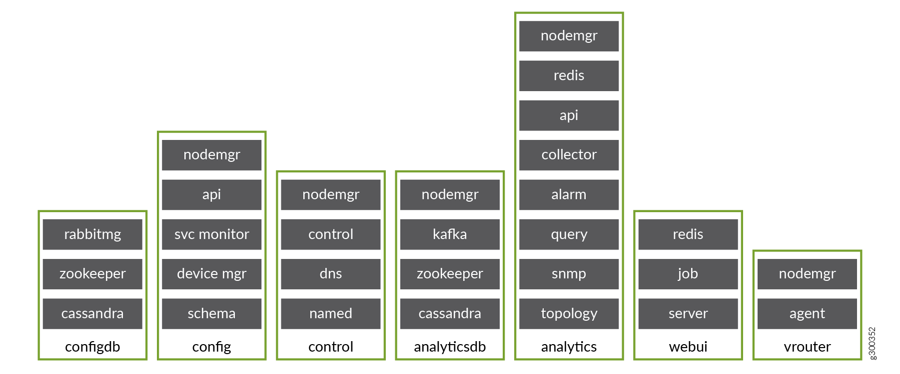

Understanding OpenSDN microservices architecture
========================================================

:date: 2020-04-07

What is OpenSDN microservices architecture?
---------------------------------------------------

Employing microservices provides a number of benefits which includes:

-  Deploying patches without updating the entire OpenSDN deployment.

-  Better ways to manage the lifecycles of containers.

-  Improved user experiences with OpenSDN provisioning and upgrading.

-  Provisioning with minimum information provided.

-  Configuring every feature.

-  Simplify application complexity by implementing small, independent
   processes.

The containers and their processes are grouped as services and
microservices, and are similar to pods in the Kubernetes open-source
software used to manage containers on a server cluster.

Figure 1 shows how the
OpenSDN containers and microservices are grouped into a pod structure
upon installation.

|Figure 1: OpenSDN Containers, Pods, and Microservices|

Installing OpenSDN with microservices architecture
--------------------------------------------------

These procedures help you to install and manage OpenSDN with
microservices architecture. 
 

