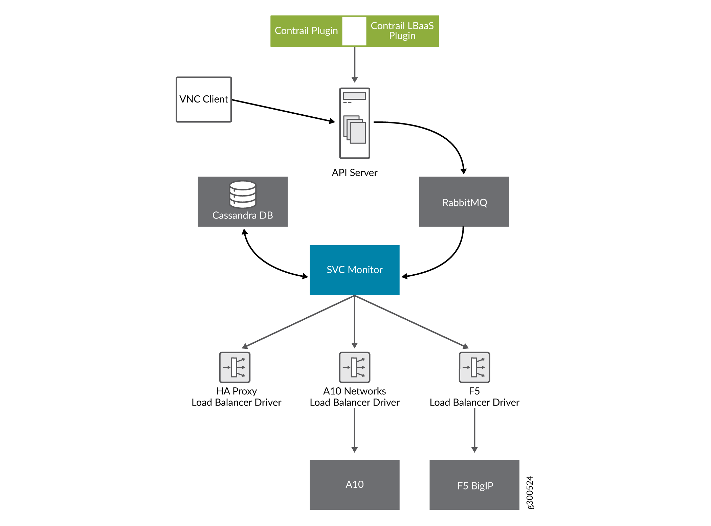
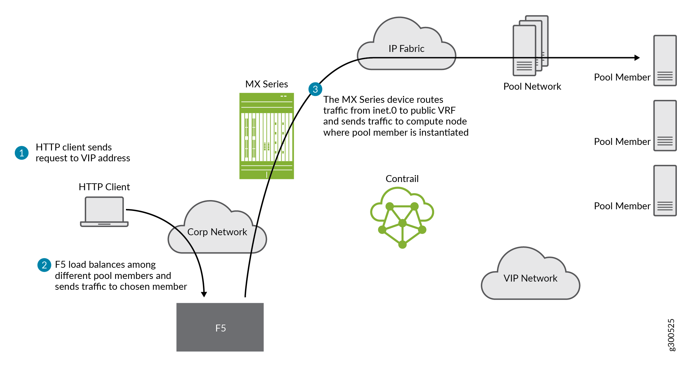

Using Load Balancers in OpenSDN
===============================

:date: 2020-05-26

As of OpenSDN 3.0, load balancer LBaaS features are available.
This topic includes:

Invoking LBaaS Drivers
----------------------

The provider field specified in the pool configuration determines which
load balancer drivers are selected. The load balancer driver selected is
responsible for configuring the external hardware or virtual machine
load balancer.

Supported load balancer drivers include:

-  HAProxy

.. note::
   Previously OpenSDN supported a number of loadbalancer plugins for A10,
   F5, and Avi Networks. None of these are supported any longer in this
   open source project; however, creation and support of additional
   load balancers is encouraged.

.. warning::
   This section of documentation is extremely out of date and should be
   treated with caution.

Benefits of Creating Configuration Objects
------------------------------------------

Starting with OpenSDN 3.0, the Neutron LBaaS plugin creates required
configuration objects (such as pool, VIP, members, and monitor) in the
OpenSDN API server, instead of within the Neutron plugin context, as in
previous releases.

This method of configuration has the following benefits:

-  Configuration objects can be created in multiple ways: from Neutron,
   from virtual controller APIs, or from the OpenSDN WebUI.

-  The load balancer driver can make inline calls, such as REST or SUDS,
   to configure the external load balancer device.

-  The load balancer driver can use OpenSDN service monitor
   infrastructure, such as database, logging, and API server.

.. note::

   The *Neutron* LBaaS plugin is not supported in OpenStack Train release.

Figure 1 provides an overview of the OpenSDN LBaaS components.

|Figure 1: OpenSDN LBaaS components with neutron-lbaas|

Using a Service Appliance Set as the LBaaS Provider
---------------------------------------------------

In OpenStack Neutron, the load balancer provider is statically
configured in ``neutron.conf``, which requires restart of the Neutron
server when configuring a new provider. The following is an example of
the service provider configuration in ``neutron.conf``.

::

   [service_providers]
   service_provider = LOADBALANCER:Opencontrail:neutron_plugin_contrail.plugins.opencontrail. loadbalancer.driver.OpencontrailLoadbalancerDriver:default

In OpenSDN 3.0 and greater, the Neutron LBaaS provider is
configured by using the object ``service-appliance-set``. All of the
configuration parameters of the LBaaS driver are populated to the
``service-appliance-set`` object and passed to the driver.

During initialization, the service monitor creates a default service
appliance set with a default LBaaS provider, which uses an HAProxy-based
load balancer. The service appliance set consists of individual service
appliances for load balancing the traffic. The service appliances can be
physical devices or virtual machines.
**Sample Configuration: Service Appliance Set**

The following is a sample configuration of the service appliance set for
the LBaaS provider:
::

   {
     "service-appliance-set": {
       "fq_name": [
         "default-global-system-config",
         "f5"
       ],
       "service_appliance_driver": "svc_monitor.services.loadbalancer.drivers.f5.f5_driver.OpencontrailF5LoadbalancerDriver",
       "parent_type": "global-system-config",
       "service_appliance_set_properties": {
         "key_value_pair": [
           {
             "key": "sync_mode",
             "value": "replication"
           },
          {
             "key": "global_routed_mode",
             "value": "True"
           }
         ]
       },
       "name": "f5"
     }
   }

**Sample Configuration: Single Service Appliance**

The following is a sample configuration of a single service appliance:
::

   {
     "service-appliance": {
       "fq_name": [
         "default-global-system-config",
         "f5",
         "bigip"
       ],
       "parent_type": "service-appliance-set",
       "service_appliance_ip_address": "<ip address>",
       "service_appliance_user_credentials": {
         "username": "admin",
         "password": "<password>"
       },
       "name": "bigip"
     }
   }

Understanding the Load Balancer Agent
-------------------------------------

The load balancer agent is a module in the service monitor. The service
monitor listens on the RabbitMQ configuration messaging queue
(``vnc_config.object-update``) to get configuration objects. The
dependency tracker triggers changes to all related objects, based on
configuration updates.

The dependency tracker is informed to notify the pool object whenever
the VIP, member, or health monitor object is modified.

Whenever there is an update to the pool object, either directly due to a
pool update or due to a dependency update, the load balancer agent in
the service monitor is notified.

The load balancer agent module handles the following:

-  Loading and unloading LBaaS driver-based service appliance set
   configuration.

-  Providing the abstract driver class for the load balancer driver.

-  Invoking the LBaaS driver.

-  Load balancer-related configuration.

